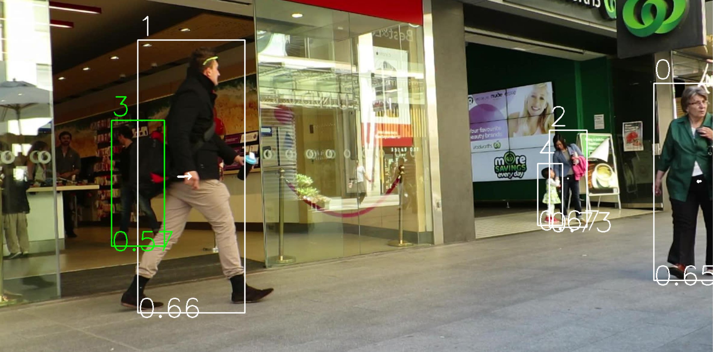

# Visual Object Tracking TP

TP5 is the final project, you can still view the previous TPs in the corresponding folders if necessary.

---

Requirements :
- `pip3 install -r requirements.txt`

---

TP5 (final project) :
- `cd TP5`
- `python3 main.py`
Put everything together, commented code, optimized execution.

YOLOV detection, ResNet18 feature extraction, Hungarian algorithm, Kalman filter, track management, etc.

A NVIDIA GPU, if present, will be used to speed up the process.

---

TP1 :
- `cd TP1`
- `python3 objTracking.py`

TP2 :
- `cd TP2`
- `python3 main.py`
In this part I first researched using a notebook then optimized the algorithms for execution in different files.

TP3 :
- `cd TP3`
- `python3 main.py`
In this part I modified `detection_association.py` to add the Hungarian algorithm.

I also added the `save_csv.py` file to save the results in a csv file according to the exercise rules.

The track outputs are in the `*.txt` files.

TP4 :
- `cd TP4`
- `python3 main.py`
Added Kalman filter to the previous TP.